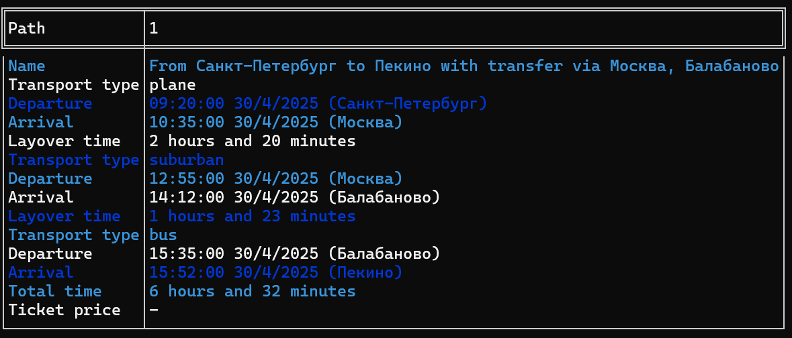

# Route-Finder

Консольное приложение для нахождения маршрутов между городами, использующее Yandex Api.

## Функциональность

Консольное приложение ищет список возможных маршрутов до пункта назначения и обратно любыми видами транспорта (например самолет + поезд) на определенную дату (передается аргументом командной строки). Найденые промежуточные результаты кэшируются в памяти и на файловой системе для уменьшения количества запросов на внешний сервис.

## Реализация

В качестве источника информации используется [API Яндекса Расписаний](https://yandex.ru/dev/rasp/doc/ru/). Апи-ключ передается в качестве аргументов командной строки

Для выполнения [HTTP-запросов](https://en.wikipedia.org/wiki/HTTP) используется бибилиотека [С++ Requests](https://github.com/libcpr/cpr). В качестве библиотеки для работы с json-ответом - [nlohmann/json](https://github.com/nlohmann/json).

## Требования

- C++20
- CMake 3.12+
- Библиотеки:
  - cpr (https://github.com/libcpr/cpr)
  - nlohmann/json (https://github.com/nlohmann/json)

## Сборка

```bash
git clone https://github.com/vanish007/Route-Finder
cd Route-Finder
mkdir build && cd build
cmake ..
cmake --build .
```

## Пример работы программы
Usage: route-finder.exe [options]

| Опция                | Аргумент         | Обязательный | Описание                           | Пример значения        |
|----------------------|------------------|--------------|------------------------------------|------------------------|
| `--date`             | `YYYY-MM-DD`     | Да           | Дата отправления                   | `2024-12-31`           |
| `-a`, `--api-key`    | строка           | Да           | API-ключ Яндекс.Расписаний         | `your_api_key_123`     |
| `-s`, `--from`       | строка           | Да           | Город отправления                  | `moscow`               |
| `-d`, `--to`         | строка           | Да           | Город назначения                   | `kazan`                |
| `-m`, `--max-transfers` | целое число  | Нет          | Максимальное число пересадок (по умолчанию 1) | `2`            |
| `-h`, `--help`       | -                | Нет          | Показать справку                   | -                      |

```bash
./route-finder  --date=2025-12-31 -s moscow -d kazan -m 2
```

```bash
route-finder.exe --date=2025-04-30 -s saint-petersburg -d pekin -m 5
```

